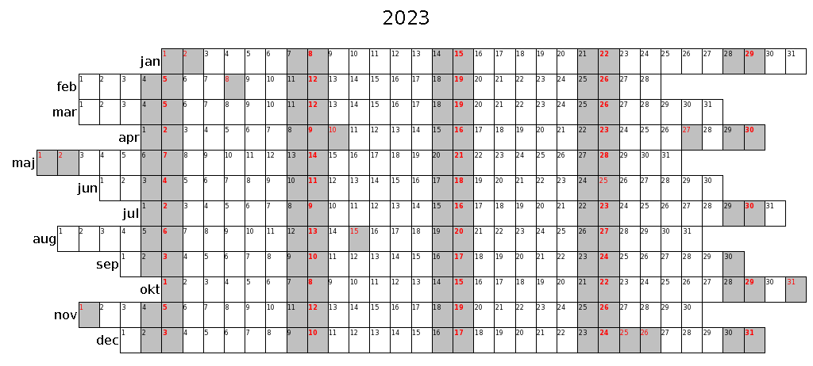

# calendar-gen

Scripts to generate yearly, monthly and weekly sheets for tracking of key periodic tasks (such as achieving daily sleep goals and daily exercise). Generates as HTML, intended to be printed on A4 page, without header and footer data. I tape them to a board and pyhsically write check marks.

[Example daily calendar for year 2023 with Slovenian holidays](examples/calendar_2023_daily.pdf) (see other examples in the **examples** folder)

NOTE: The scripts currently generate month and week names from current locale. Holidays are marked if the current locale country is supported by the Python holidays library (https://pypi.org/project/holidays/). Week numbers are by ISO 8601 standard. PDF are generated at page size A4.

Requirements:
* Python 3 (tested with 3.7.3)
   * install required libraries with `pip3 install -r requirements.txt`
* `wkhtmltopdf` executable in path to generate PDF. If not present, only HTML format will be generated.

## FAQ

### Why physical paper? There's an app for that!

Of course there's an app for that, but the app requires:
- unlocking the phone,
- navigating to the app,
- navigating the app UI to appropriate place,
- placing the completion marker.

On the other hand, paper requires:
- taking a pen from the holder on the board,
- ticking the appropriate boxes.

I didn't want to complicate already tedious routine tasks with any more bureaucracy than strictly neccessary.

### Why not interactive page? Why CLI script?

Planned.
